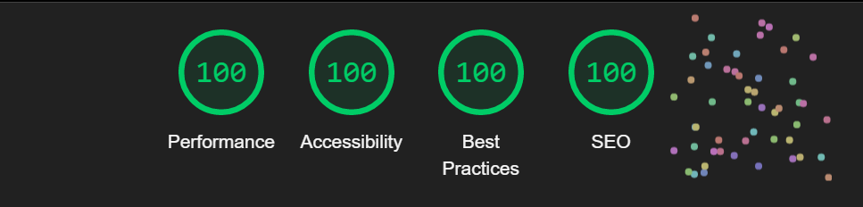

# Coins et recoins de la France
*Nooks &amp; crannies of France - sample landing page with picture from France*

Live view: 

## Introduction
`Partez en voyage à travers la France! - Go on a journey through France!
This is sample landing page for someone who wants to see nooks and crannies of France.` 

While encoding Landing Page, I focused on the CLS problem. It is one of the most important elements in website optimization and directly influences the user's experience

What is CLS?
> CLS is a measure of the largest burst of layout shift scores for every unexpected layout shift that occurs during the entire lifespan of a page. A layout shift occurs any time a visible element changes its position from one rendered frame to the next.

The main advantage of using this practice is the better results of CLS, because with the slow Internet, the graphics are rendered in relative containers that have already been assigned the appropriate height and width.

## Technologies
+ Semantic HTML
+ SASS
+ Responsive Web Design
+ Cumulative Layout Shift

## License
All picture was taken from https://unsplash.com/. They have free license for commercial and non-commercial purposes.

## Lighthouse Report

